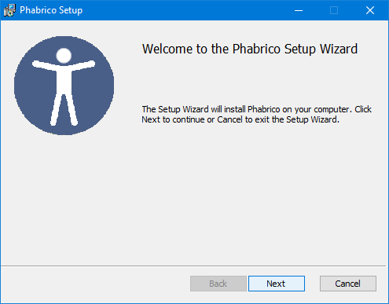
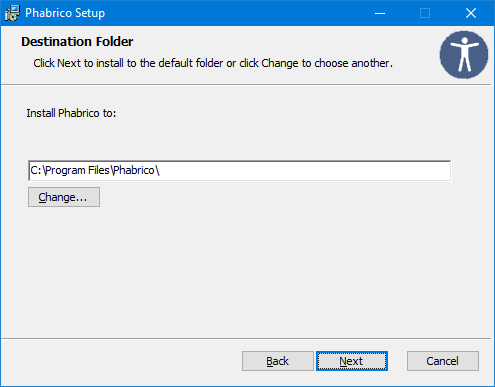
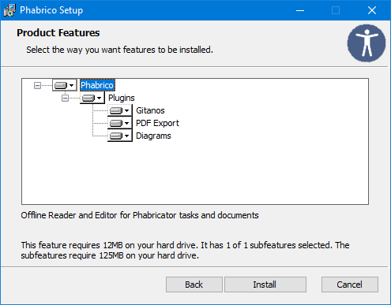
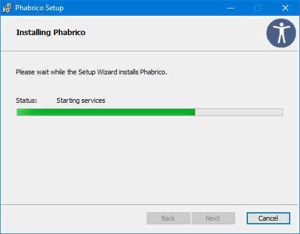
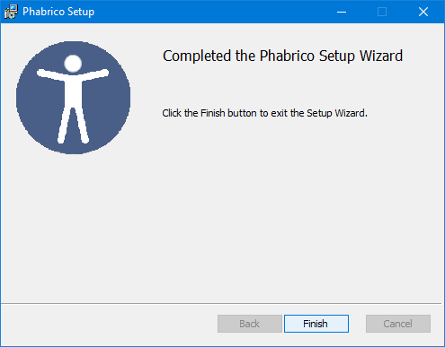
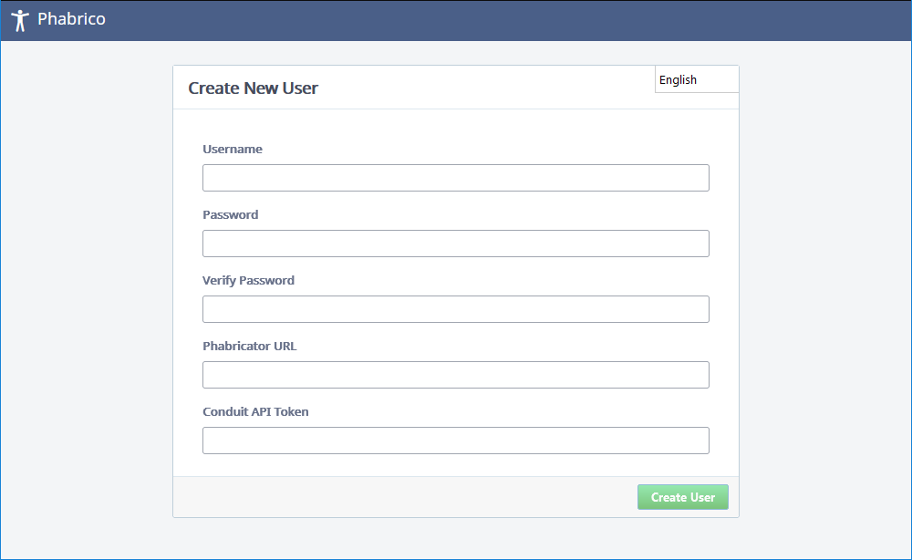
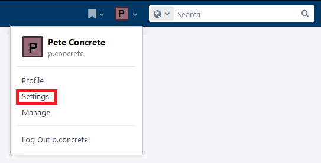
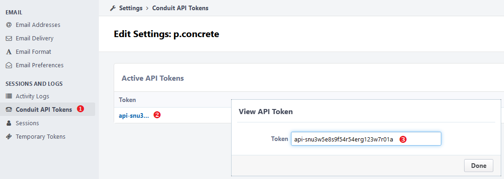
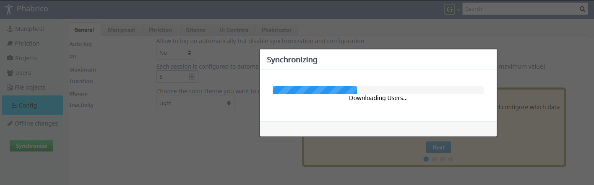
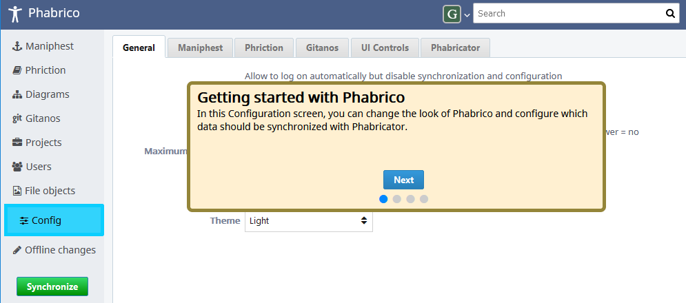

# Installation

The MSI installer for Windows can be found here: https://github.com/Phabrico/Phabrico/releases/latest

 
Click *Next*

 
Set the path to where Phabrico should be installed to and click *Next* afterwards.
 Note: the local database itself will be installed in the user's document directory.

 
You can extend your Phabrico with some plugins.
 Click *Install* afterwards.

 
Phabrico will be installed.

If everything went OK, you should see this dialog:
 
After you click *Finish* to close the installer, your browser will open the Phabrico website.

# Configuring the connection between Phabrico and Phabricator

 The first time you browse to the Phabrico website, you will see this screen:

 
In the top right corner, you can change the language of the application.

You need to enter a username and a password.
These credentials are only used by Phabrico and don't need to be the same as the ones you use for Phabricator.

The Phabricator URL is the web address where the Phabricator website is located.

The Conduit API token is a token which allows Phabrico to communicate with Phabricator.
This token is a personal token which can be retrieved in Phabricator via the *Settings* menu in your personal menu at the top right: 

After clicking the green *Create User* button in Phabrico, a connection will be established with the Phabricator webserver.
It will download all available projects and user accounts from the Phabricator server.

These will be used later on to configure the synchronization process between Phabrico and Phabricator.

After the first synchronization process between Phabrico and Phabricator, you will get a short introduction:

