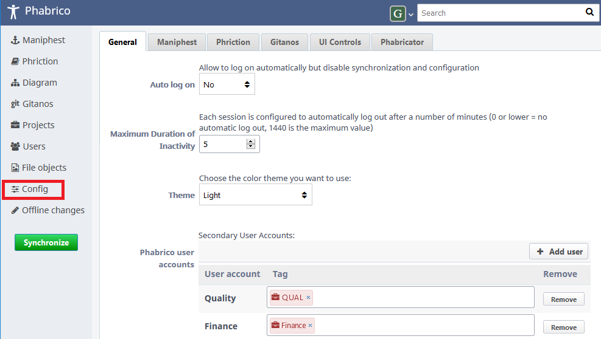
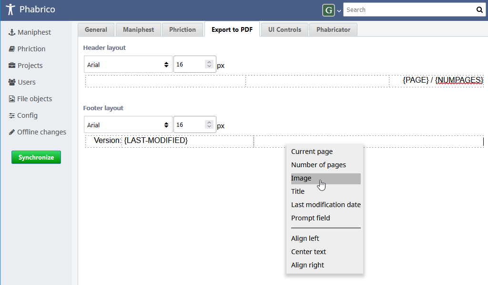

# Configuring Phabrico

 The *Config* screen contains a number of settings in which you can configure the look and feel of Phabrico 
  

## General settings

| Parameter                      | Description                                                  |
| ------------------------------ | ------------------------------------------------------------ |
| Auto log on                    | If set to *Yes*, you won't need to log in with a username and password. However, you won't be able to open this *Config* screen and you won't be able to synchronize with Phabricator. You still need to log in with your username and password. By logging off, you can log in with a user name and password:  |
| Maximum Duration of inactivity | Phabrico disconnects the browser after a period of inactivity. You can configure the time span in here. |
| Theme                          | You can choose a light theme or a dark theme. If you choose a dark theme, you get also the option to darken bright images:   - *Disabled* keep the bright images as they are - *Moderate* puts some kind of a dark shade over the images. White background will look gray. - *Extreme* tries to invert the bright images but keeps the colors. White will be black, but green for example remains (lighter) green |

## Maniphest settings

| Parameter                               | Description                                                  |
| --------------------------------------- | ------------------------------------------------------------ |
| Synchronize Maniphest tasks for         | Maniphest tasks to be downloaded from Phabricator can be filtered per selected users or per selected projects. The user selection can be done in the *Users* screen. The project selection can be done in the *Projects* screen |
| Mark new/modified Maniphest tasks as    | When a new Maniphest task is created or an existing Maniphest task is modified, the task can be set into a *Frozen* or an *Unfrozen* state. *Frozen* means that the modified or created task will not be uploaded to Phabricator when Phabrico is being synchronized with Phabricator. *Unfrozen* is the opposite: modified or created tasks will be uploaded. |
| Maximum lifetime closed Maniphest tasks | After a task is marked closed in Phabricator, the task may still be known in Phabrico. With this parameter you can specify when closed tasks should be removed from Phabrico's local database |

## Phriction settings

| Parameter                                | Description                                                  |
| ---------------------------------------- | ------------------------------------------------------------ |
| Synchronize Phriction documents for      | Phriction documents to be downloaded from Phabricator can be filtered per selected users or per selected projects. The user selection can be done in the *Users* screen. The project selection can be done in the *Projects* screen |
| Mark new/modified Phriction documents as | When a new Phriction document is created or an existing Phriction document is modified, the document can be set into a *Frozen* or an *Unfrozen* state. *Frozen* means that the modified or created document will not be uploaded to Phabricator when Phabrico is being synchronized with Phabricator. *Unfrozen* is the opposite: modified or created documents will be uploaded. |
| Show Phriction metadata                  | If set to true, metadata like referenced project tags, subscribers, timestamp last modification will be visible in the action pane on the right when opening a Phriction document. See also setting "*Force download all Phriction metadata*" |
| Force download all Phriction metadata    | At the moment, Phabrico is not able to detect a newly added project tag or a subscriber to a Phriction document (without changing the document's content). To overcome this the incremental download of Phriction documents can be disabled by setting this parameter to *Yes*. This will slow down the synchronization process between Phabricator and Phabrico |

## Gitanos (plugin) settings

| Parameter              | Description                                                  |
| ---------------------- | ------------------------------------------------------------ |
| Local root directories | A local root directory is a directory which contains local git repositories. The git repositories should be a direct subdirectory of this root directory. If for example a git repository is stored in a subdirectory of a subdirectory, the git repository will not be monitored. |
| Notification           | Gitanos may show a notification in Phabrico's navigation menu:   This number is the summation of all git states over all repositories in all local root directories. The states that are summarized are the ones that are configured in this parameter. |

## Export to PDF (plugin) settings

A header and a footer can be configured for the Export to PDF functionality in Phriction. 
Both can be confgired in 3 resizable columns: a left area, a center area and a right area. 
  
A font can be configured per footer and header. 
By right-clicking on a footer or header area, you can add some generated parameters: 
| Parameter                      | Description                                                  |
| ------------------------------ | ------------------------------------------------------------ |
| Current page                   | Shows the current page number |
| Number of pages                | Shows the total number of pages in the generated PDF file |
| Image                          | Imports a local image |
| Title                          | Shows the title of the document to be exported |
| Last modification date         | Shows the last modification of the document to be exported |
| Prompt field                   | Prompts just before the export action a messagebox in which you can enter a custom value. For example:  |
| Align left                     | Aligns the text in the footer / header area to the left |
| Center text                    | Centers the text in the footer / header area |
| Align right                    | Aligns the text in the footer / header area to the right |

## UI Controls settings

| Parameter                           | Description                                                  |
| ----------------------------------- | ------------------------------------------------------------ |
| Add Copy button                     | If set to *Yes*, a *Copy* button will be displayed in the top right corner when the mouse is hovered over a code block. For example:  |
| Translate notification block titles | If set to Yes, the NOTE, IMPORTANT and WARNING texts are translated according to the user's configured language:  |
| Confidential Table Headers          | Here you can enter table headers whose values should initially not be visible. Their values will be visible for 3 seconds when you hover over their values:  |

[Index](../README.md) | [Previous Page](../01-Installation/README.md) |  [Next page](../03-Projects/README.md)