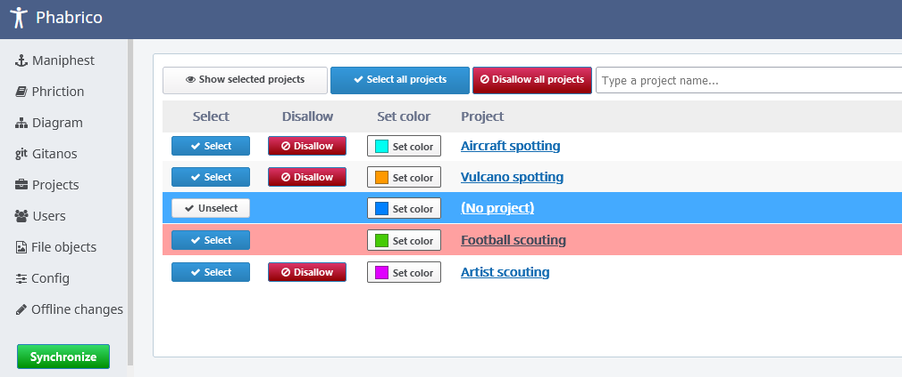
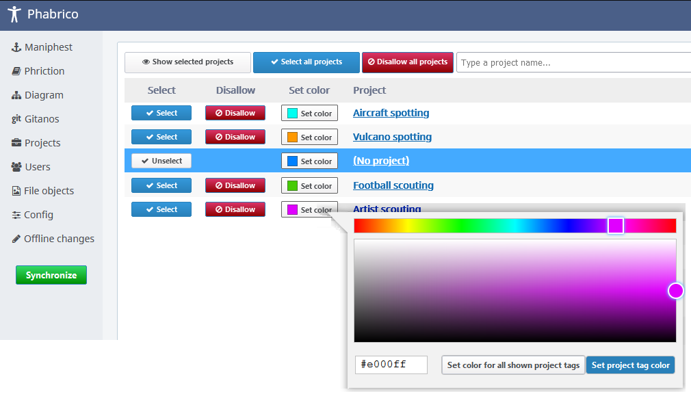

# Project configuration

 The *Projects* screen displays a list of projects known in Phabricator: 
   The list of projects can be filtered by entering text in the filter field on top.

## Synchronization configuration

This screen is mainly meant for configuring which Maniphest tasks and/or which Phriction documents should be downloaded from Phabricator.
These settings can be configured in the *Config* screen under the *Maniphest* and *Phriction* tabs.

In case for any of *Maniphest* or *Phriction* the synchronization is set to *Selected projects* (or derived), then only the *Maniphest* tasks or *Phriction* pages referenced by projects that are selected in this *Projects* screen are downloaded from Phabricator.

Projects can also be disallowed to be downloaded.
If, for example, a Maniphest task is linked to 2 projects.
One of them is a selected project but the other is disallowed, then the Maniphest task will not be downloaded.
  

You can also configure in the *Config* screen to allow only downloads when all linked project tags are selected.

## Color visualization

You can also configure the color of a project tag to better distinguish them in the *Maniphest* overview screen: 
   By clicking on the *Set color* button, you can assign a color.

By clicking *Set project tag color* you will assign the color only to the reference project tag.
If you click however on the *Set color for all shown project tags*, the color will be assigned to all listed project tags.

[Index](../README.md) | [Previous Page](../02-Configuration/README.md) |  [Next page](../04-Users/README.md)