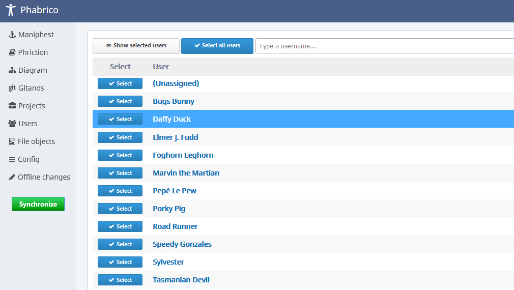

# User configuration

 The *Users* screen displays a list of users known in Phabricator:
   The list of users can be filtered by entering text in the filter field on top.

## Synchronization configuration

This screen is mainly meant for configuring which Maniphest tasks should be downloaded from Phabricator.
This can be configured in the *Config* screen under the *Phriction* tab.

In case the *Synchronize Phriction documents for* parameter is set to *Selected users*, then only the tasks referenced by users that are selected in this *Users* screen are downloaded from Phabricator.

[Previous Page](../03-Projects/README.md) |  [Next page](../05-Maniphest/README.md)