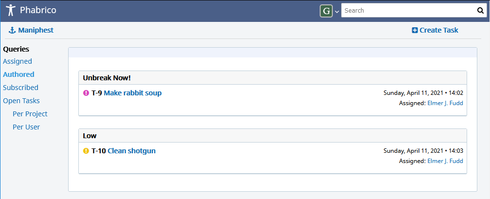
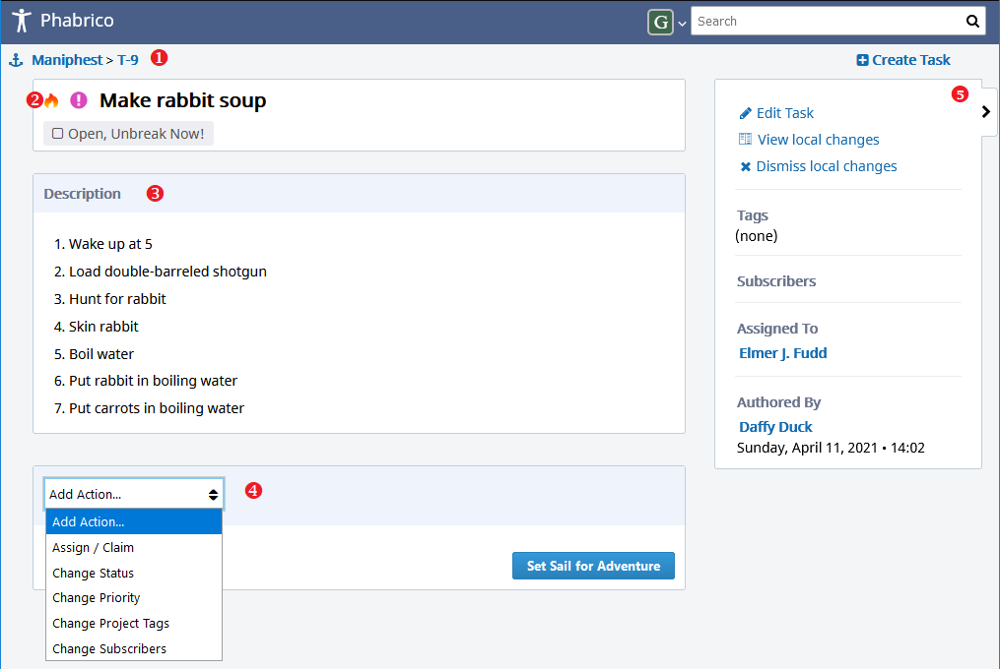
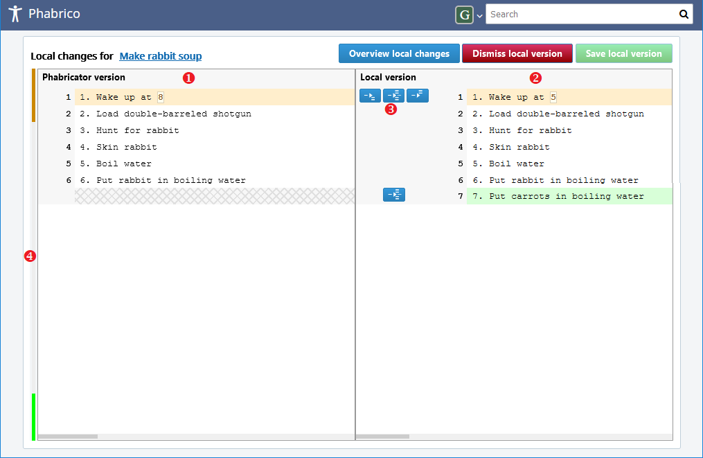
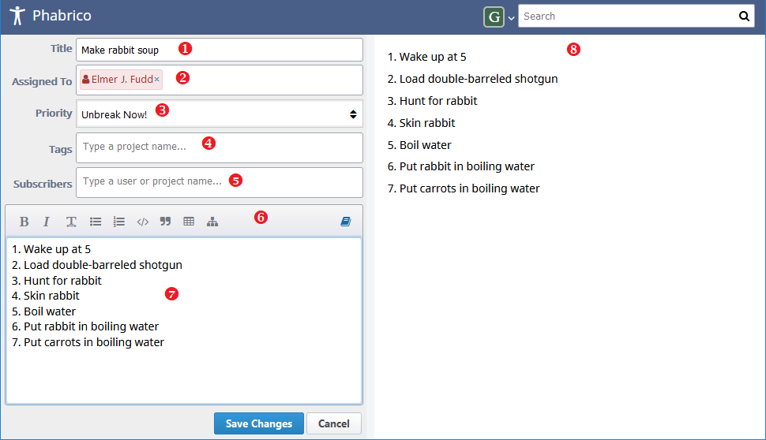

# Maniphest tasks

 The *Maniphest* task overview screen displays a list of tasks to be performed:
  

## Maniphest task

The following information can be found in a single Maniphest task:

   

### 1. Maniphest task identifier

The Maniphest task identifier is formatted as "T" plus a number. E.g. T-9.
If this number is a negative number, then the task was created or modified in Phabrico.

### 2. Maniphest task title

The Maniphest task title is shown below the task identifier.

Besides the title itself, other data is also shown in this area, like the state and the priority of the task.
If the task was created or modified in Phabrico, you may also see a flame or a snow icon.
A flame icon tells you that the task is in an *Unfrozen* state, i.e. if you synchronize Phabrico with Phabricator, the task will also be uploaded to Phabricator.
A snow icon indicates that the task is in a *frozen* state, i.e. if you synchronize Phabrico with Phabricator, the task will not be uploaded to Phabricator.

### 3. Maniphest task description

Below the Maniphest task title you can find the task description.
The content can be modified by the *Edit Task* option in the action pane on the right.

### 4. Comment area

In the comment area you can execute some specific actions on the  Maniphest task.

- You can assign the task to someone else
- You can change the state of the task (e.g. closed)
- You can change the priority of the task
- You can assign or remove referenced project tags
- You can add or remove a subscriber for this task

### 5. Action pane

The action pane on the right shows additional information but also contains some links where more extensive actions can be performed on the task.
The action pane can be hidden by means of the arrow button at the right.

#### 5.1 Edit Task

Allows you to edit the content of the task.
See for more information further below.

#### 5.2 View local changes

*View local changes* will show you the differences between the last download from Phabricator and the current task content.

   The original Phabricator content is shown the left (1), while the current Phabrico version is shown at the right (2).

Lines which differ are marked by means of color.
At the right of the screen, you have a location pane which contains a color visualization of all lines (whether being modified or not)

 There are some merge actions (3) possible, in case the content at Phabricator was modified by someone else:

* insert left block before right block
* replace right block with left block
* insert left block after right block

After the merge action is completed, you can save the merged content by means of the *Save local version* button at the top.

You can also undo your local changes by means of the *Dismiss local version* button.
By doing so, you will keep the Phabricator's version.

The *Overview local changes* will show you the *Offline changes* screen, in which you can find all your local modifications which have not been uploaded to Phabricator.

#### 5.3 Dismiss local changes

This will undo your local modifications.
By doing so, you will keep the Phabricator's version of the task.

#### 5.4 Tags and Subscribers

Visualizes one or more project tags which are linked to this task and subscribers which need to be informed of the state of this task.

#### 5.5 Assigned To  and  Authored By

Who will execute the task  and  who wrote the task  

## Editing or creating a Maniphest task

The following screen is shown when you click on *Edit Task* in the action pane.

   

### 1. Title

The title of the task

### 2. Assigned to

The person who should perform the task.
Only 1 person can be assigned.
An overview of available persons can be found in the *Users* screen.

### 3. Priority

The priority of the task

### 4. Tags

One or more projects that are linked to the task.
Only project tags known in Phabricator (and been downloaded into Phabrico) can be used.
An overview of available project tags can be found in the *Projects* screen

### 5. Subscribers

Users or projects which should be informed about the state of this task.

### 6. Remarkup toolbar

The toolbar at the top contains some aids to make editing the text in the *Remarkup editor* little easier.

### 7. Remarkup editor

The content of the task in Remarkup format.

### 8. Task presenting content

The WYSIWYG content of the task.

