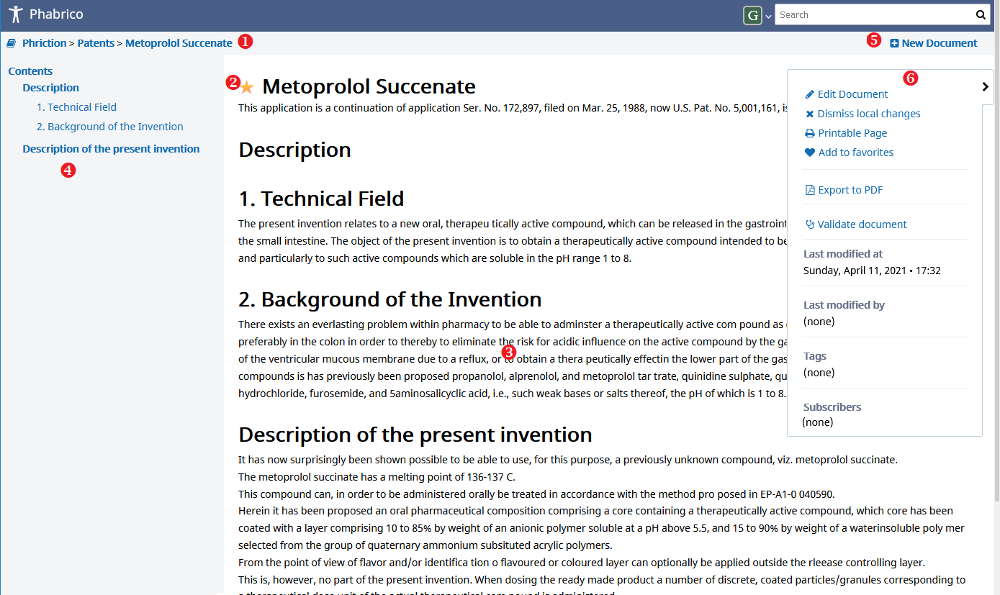
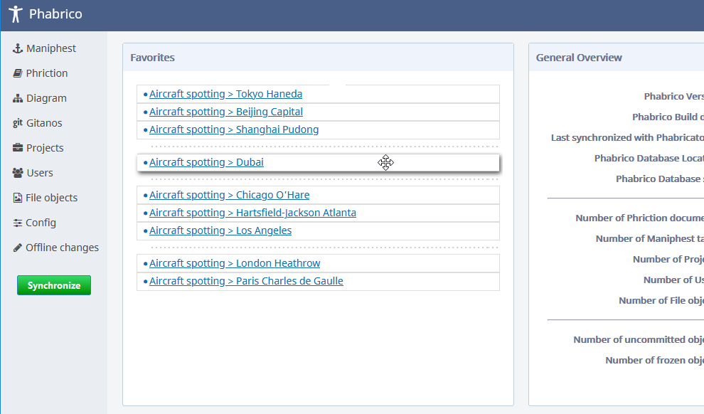
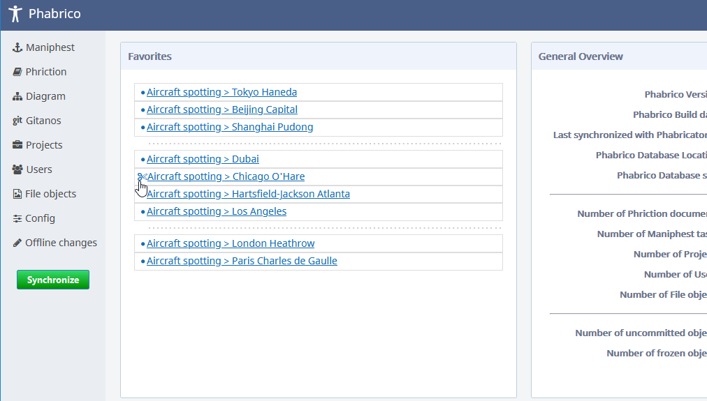
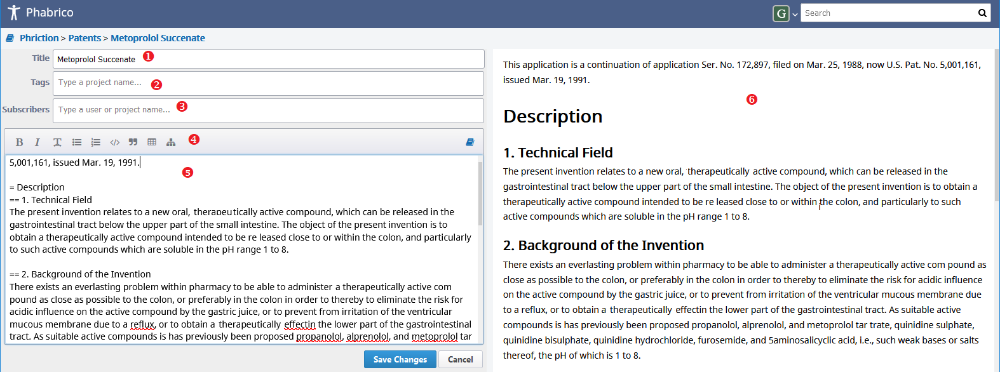

# Phriction wiki pages

*Phriction* is a wiki. You can view and edit pages

## Components

  

*Phriction* consists of the following parts:

### 1. Breadcrumb navigation

allows you to keep track and maintain awareness of the location within the wiki editor

### 2. Document title

Title of the document.
An icon may appear in front of the document's title:

* A yellow star indicates that the document was created in Phabrico and does not exist in Phabricator
* A flame indicates that the document was modified in Phabrico and is marked as *Unfrozen*. The document will be uploaded during the next synchronization action.
* A snowflake indicates that the document was modified in Phabrico and is marked as *Frozen*. The document will not be uploaded during the next synchronization action.

### 3. Content of the document

This area can contain formatted text, tables, images, video, ...
The content can be edited by means of Remarkup formatting.
See further below.

### 4. Table of content

This area contains the table of content.
This table of content is generated based on the content of the document.
If there are no headers in the document content, no table of content will be visualized.

### 5. New Document

*New Document* will create a new sub-page under the current wiki page

### 6. Action pane

The action pane on the right shows additional information but also contains some links where more extensive actions can be performed on the current wiki page.
The action pane can be hidden by means of the arrow button at the right.

#### 6.1 Edit Document

Allows you to edit the content of the wiki page.
See for more information further below.

#### 6.2 Dismiss local changes

This will undo your local modifications.
By doing so, you will keep the Phabricator's version of the wiki page.

#### 6.3 Printable Page

Shows the current wiki page in form that can be used to print or export.
I.e. the header on top, the table of contents and the action pane will be hidden.
To return back to the original format, click on the *Return* button in the top right corner.

#### 6.4 Add to favorites / Remove from favorites

Links to wiki pages can be added on Phabrico's initial homepage by clicking on *Add to favorites*.
To remove a page from the homepage, click on *Remove from favorites*

 Favorites can be relocated by drag and drop them:   

Favorites can also be grouped by clicking on the dot next to it (a scissor should appear):  

To ungroup favorites, click in front of the split line

#### 6.4 Export to PDF  (Plugin)

*Export to PDF* will export the current wiki page (and all underlying wiki pages if wanted) to a PDF file.
For this functionality you need to have the PhrictionToPDF plugin installed. 

#### 6.4 Metadata

Metadata like linked projects, subscribers or who modified the last time the current wiki page are shown at the bottom.
Attention: in case a project or a subscriber has been added or removed in Phabricator, Phabrico will not detect this in case the content of the wiki page was not modified.
See also [Phriction's configuration documentation)](../02-Configuration/README.md) 

## Editing or creating a wiki page

The following screen is shown when you click on *Edit Document* in the action pane.

  

### 1. Title

The title of the document

### 2. Tags

One or more projects that are linked to the wiki page.
Only project tags known in Phabricator (and been downloaded into Phabrico) can be used.
An overview of available project tags can be found in the *Projects* screen

### 3. Subscribers

Users or projects which should be informed about the modifications of this wiki page.

### 4. Remarkup toolbar

The toolbar at the top contains some aids to make editing the text in the *Remarkup editor* little easier.

### 5. Remarkup editor

The content of the wiki page in Remarkup format.

### 6. Task presenting content

The WYSIWYG content of the wiki page.

[Previous Page](../05-Maniphest/README.md) |  [Next page](../07-Remarkup/README.md)