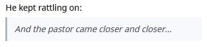

# Remarkup

Phabricator and Phabrico use a lightweight markup language called "Remarkup", similar to
other lightweight markup languages like Markdown and Wiki markup.

## General

The editors in Phriction and Maniphest contain a code editor on the left and a WYSIWYG result on the right:

 

The toolbar on top of the code editor contains the following formatting actions:

| Icon                                        | Description                                                  |
| ------------------------------------------- | ------------------------------------------------------------ |
|  | Formats the (selected) text in bold                          |
|  | Formats the (selected) text in italic                        |
|  | Formats the (selected) text in monospaced text               |
|  | Creates a bulleted list For example:  |
|  | Creates a bulleted list For example:  |
|  | Creates a code block For example:  |
|  | Creates a quote block For example:  |
|  | Creates a table                                              |
|  | Creates a diagram. You need to have the Diagrams plugin installed for this |

At the right end you find the book icon which explains the Remarkup syntax more in detail

## Drag and drop functionalities

Files can be drag-and-dropped into the code editor area: 
  
The code editor area will color green until you dropped the file.
If the file is an image, the image will be shown as is in the right WYSIWYG area.
If the file is not an image (e.g. a PDF file), an icon representing the file be shown.  
For example: 
   

Audio and video files will also directly visualized.  
For example:  
  

## Copy / Paste functionalities

Table data from Microsoft Excel can be directly copy pasted if the table does not contain merged cells.
Color and formatting aren't copied.
However, a formatted Excel cell will be seen as header cell in Remarkup (it will be visualized bold) 
For example:  
  
  

[Index](../README.md) | [Previous Page](../06-Phriction/README.md) |  [Next page](../08-OfflineChanges/README.md)