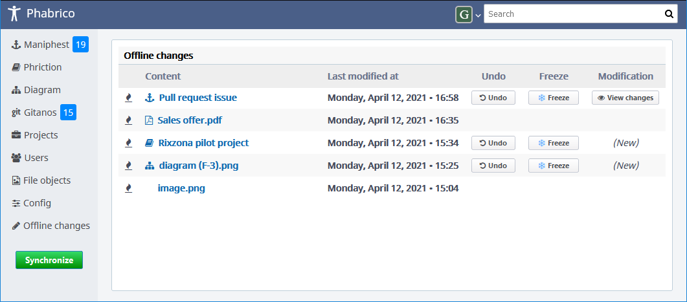

# Offline Changes

The *Offline Changes* screen presents a list of local modifications that have not (yet) been uploaded to Phabricator:

   
There are 3 actions you can perform on a modification:

| Action             | Description                                                  |
| ------------------ | ------------------------------------------------------------ |
| Undo               | This will delete your local modifications. The content of this task or wiki page will be the one of Phabricator (or at least the version since your last synchronization) If the reversed modification was a task or wiki page, all referenced added files will also be removed. |
| Freeze or Unfreeze | By freezing a modification you can prevent this modification being uploaded to Phabricator. Frozen modifications are visualized with a snow icon in front of it. Unfrozen modifications have a flame icon |
| View changes       | This will show a screen where you get can see your modifications compared to the (original) Phabricator version. This button is only visible if a Phabricator version of this task or wiki page exists. If this task or wiki page was created in Phabrico, you will see the text *(New)* instead. |

[Previous Page](../07-Remarkup/README.md) |  [Next page](../09-FileObjects/README.md)