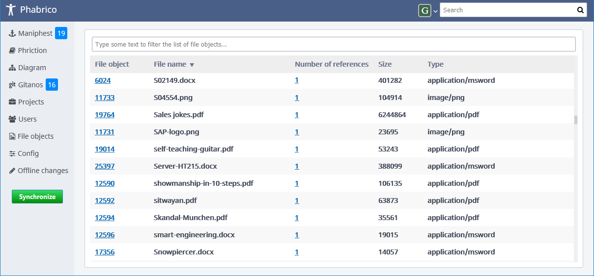

# File objects

The *File objects* screen presents a list of all file objects which have been referenced by Maniphest tasks or Phriction documents:

   

[Index](../README.md) | [Previous Page](../08-OfflineChanges/README.md) |  [Next page](../10-Diagrams/README.md)