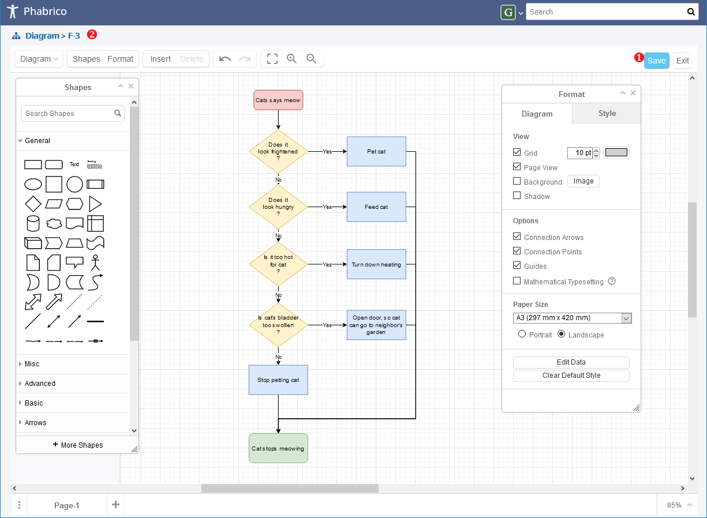
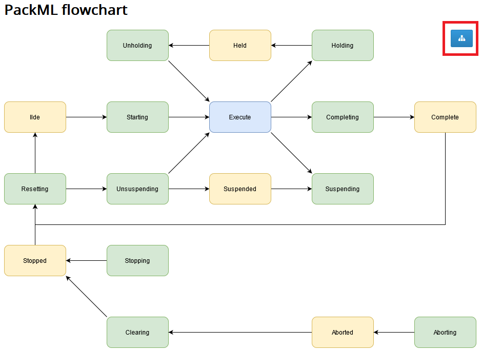
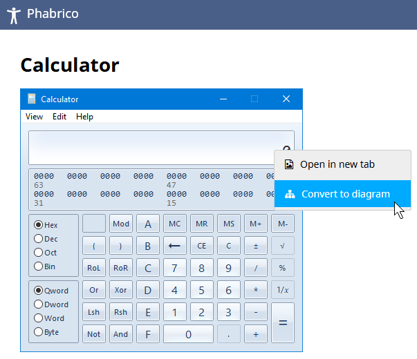
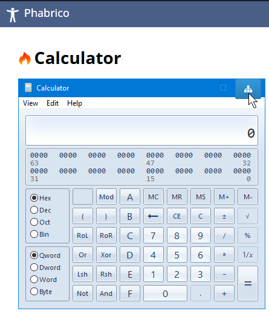
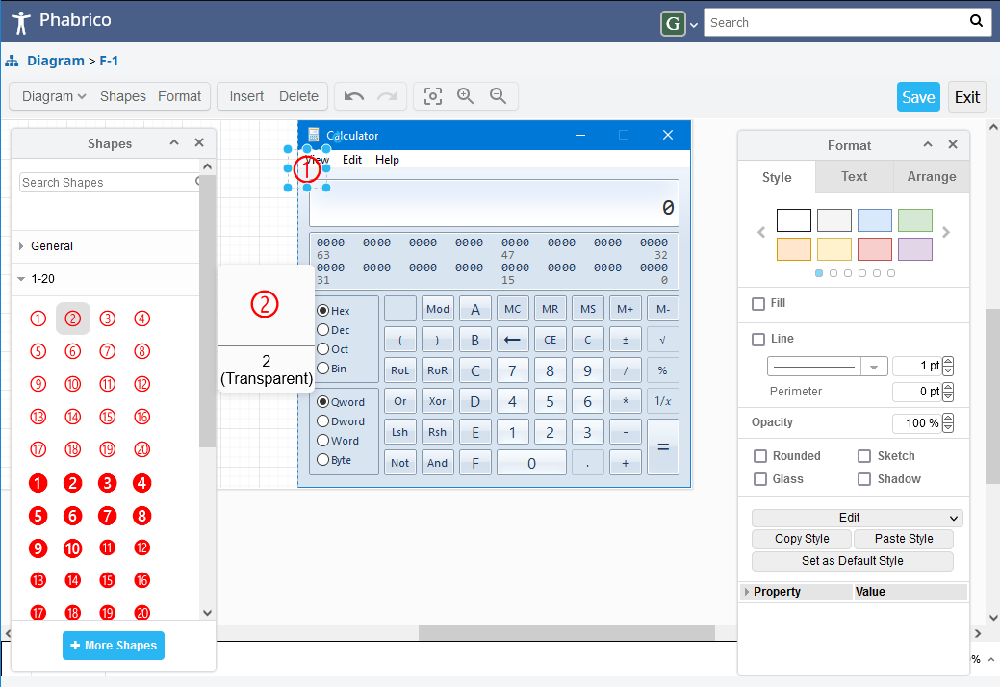
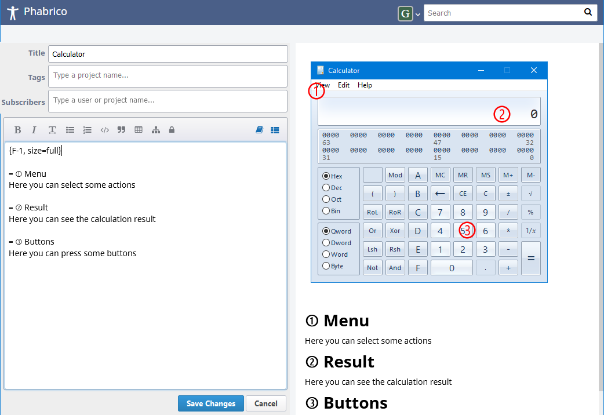

# Diagrams

Diagrams is an embedded integration of Diagrams.net (formerly known as Draw.io) and allows you to draw diagrams of all kind.

  

When you click on the Save button(1) in the top right corner, the diagram will be saved as a PNG file.
This PNG file contains some metadata which allows you to edit diagram afterwards again.
If you upload the file to Phabricator, Phabricator will still see the file as an ordinary PNG file.

The name of the diagram can be found at the top left (2).
The name is formatted as "F" + a number (e.g.  F-3).
If this number is a negative number, then the diagram was edited or created in Phabrico.
If it is a positive number, then the diagram has not been edited yet in Phabrico.

If you edit a diagram that was previously uploaded to Phabricator (and thus has a positive number in its name), and you save it, the diagram will be reloaded. The diagram will now have a negative number in its name.

When you hover over a diagram in a Maniphest task or a Phriction wiki page, you may see a diagram icon appear in the top right corner of the diagram. 
For example: 

If you click on it, the Diagram editor will be opened.

The user manuals for Diagrams.net can be found at <https://www.diagrams.net/doc/>

## Annotations
Diagrams.Net can also be used for annotating screenshots or pictures.
After pasting a screenshot in a wiki document, you can convert the image into a diagram by right-clicking on the image and select //Convert to diagram//:

The image can then be edited in Diagrams.Net by clicking on the blue icon in the top right corner of the image:

Annotation numbers can be selected from the "1-20" shapes on the left:

By pressing CTRL and a number, you can enter the annotation number in Remarkup:

[Index](../README.md) | [Previous Page](../09-FileObjects/README.md) |  [Next page](../11-Gitanos/README.md)