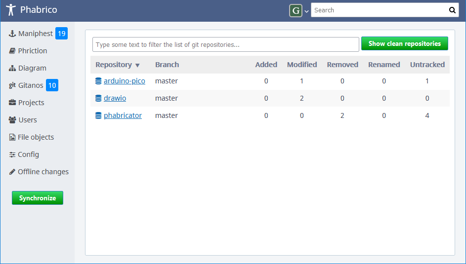

# Gitanos

Gitanos is a management system for local git repositories. It visualizes the state of all available local git repositories.

By default, it shows the repositories, found in your root directories, which contain modifications, like new files, removed files, modified files, ...

  
 When you click on the *Show clean repositories* button in the top right corner, you may also see the repositories which have no modifications in them:

  
For each repository, the number of modifications per type is shown in columns together with the current branch.

When you click on a repository, you will see an overview of the files that have been modified:

  
When you click on the file, you will see a diff view of this file:
  
You can edit this file directly by clicking the *Edit* button in the top right corner:

  

In the files overview screen you can select 1 or more files for a commit.
After clicking the COMMIT button in the top right corner, you need to enter a commit message.

  

The local commit is visible on top of the screen:   
With the PUSH button in the top right corner you can push the local commit to your remote git repository.

Local commits and modifications can be undone by means of the *Undo* buttons.

