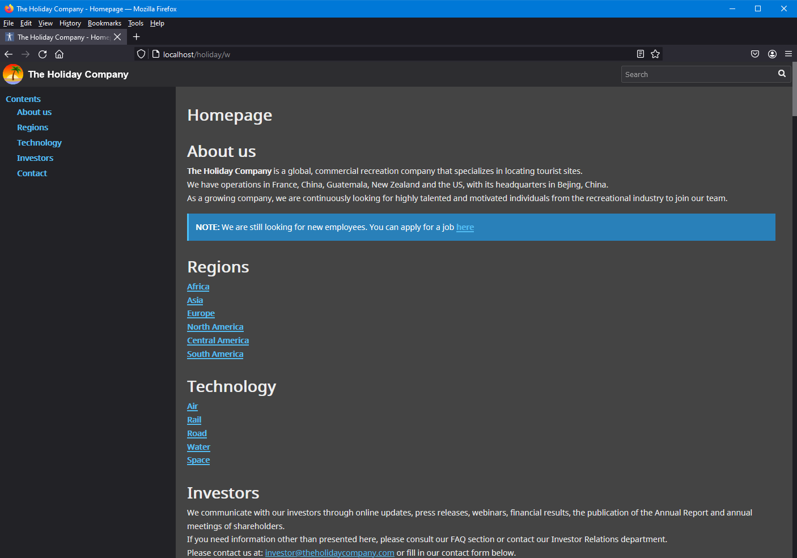

# Customization

Phabrico can be installed as a customizable HTTP module in IIS.

## Quick guide
Basically you need to implement the following things:
- a class that inherits from `IHttpModule`
- a static reference to `Phabrico.Http.Server`
- a static constructor in which you initialize and customize Phabrico by means of the `Customization` object
- an `Init` and `Dispose` method (inheriting from `IHttpModule`)
  - the `Init` class method should execute the `Init` method from the `Phabrico.Http.Server`
  
The parameters for the `Phabrico.Http.Server` constuctor should be:

| #  | Parameter                  | Value                                       |
|----|----------------------------|---------------------------------------------|
| 1  | `bool remoteAccessEnabled` | true                                        |
| 2  | `int listenTcpPortNr`      | -1                                          |
| 3  | `string rootPath`          | (the baseURI you want to use in your URL)   |
| 4  | `bool isHttpModule`        | true                                        |

An exampe in C#:

``` cs
using System.Drawing;
using System.Web;

namespace Phabrico
{
    public class IISModule : IHttpModule
    {
        static Phabrico.Http.Server httpServer;

        static IISModule()
        {
            httpServer = new Phabrico.Http.Server(true, -1, "holiday", true);

            httpServer.Customization.ApplicationName = "The Holiday Company";
            httpServer.Customization.ApplicationNameStyle["color"] = "white";
            httpServer.Customization.ApplicationNameStyle["font-weight"] = "bold";
            httpServer.Customization.ApplicationNameStyle["font-size"] = "17px";
            httpServer.Customization.ApplicationNameStyle["font-family"] = "lato,sans-serif";

            httpServer.Customization.ApplicationLogo = new Bitmap(typeof(IISModule).Assembly.GetManifestResourceStream("Phabrico.Images.logo.png"));

            httpServer.Customization.Theme = ApplicationCustomization.ApplicationTheme.Dark;
            httpServer.Customization.Language = "en";

            httpServer.Customization.HideConfig = true;
            httpServer.Customization.HideFiles = true;
            httpServer.Customization.HideManiphest = true;
            httpServer.Customization.HideNavigatorTooltips = false;
            httpServer.Customization.HideOfflineChanges = true;
            httpServer.Customization.HidePhriction = false;
            httpServer.Customization.HidePhrictionActionMenu = true;
            httpServer.Customization.HidePhrictionFavorites = true;
            httpServer.Customization.HideProjects = true;
            httpServer.Customization.HideSearch = false;
            httpServer.Customization.HideUsers = true;
            httpServer.Customization.IsReadonly = true;
        }

        public void Init(HttpApplication application)
        {
            httpServer.Init(application);
        }

        public void Dispose()
        {
        }
    }
}
```

 <br />


## Customization parameters

| Parameter                                   | Description                                                                                                                         |
| ------------------------------------------- | ----------------------------------------------------------------------------------------------------------------------------------- |
| ApplicationCSS                              | Global cascading style sheets which are injected in each page                                                                       |
| ApplicationLogo                             | The logo that should be shown in the top left corner                                                                                |
| ApplicationName                             | The name of the application that should be shown in the top left corner                                                             |
| ApplicationNameStyle                        | CSS styles for formatting the ApplicationName                                                                                       |
| HideChangeLanguage                          | If true, the menu item 'Change language' in the menu next to the search field will not be visible                                   |
| HideConfig                                  | If true, Config screen will not be accessible                                                                                       |
| HideFiles                                   | If true, Files screen will not be accessible                                                                                        |
| HideOfflineChanges                          | If true, Offline Changes screen will not be accessible                                                                              |
| HideManiphest                               | If true, Maniphest tasks will not be accessible                                                                                     |
| HideNavigatorTooltips                       | If true, the tooltips for the menu items in the homepage will not be shown                                                          |
| HidePhriction                               | If true, Phriction/wiki documents will not be accessible                                                                            |
| HidePhrictionActionMenu                     | If true, the menu on the right side of the Phriction documents is no longer visible                                                 |
| HidePhrictionChanges                        | If true, the changes made in Phriction/wiki documents can not be seen or undone                                                     |
| HidePhrictionFavorites                      | If true, Phriction/wiki documents can not be marked as favorite                                                                     |
| HideProjects                                | If true, Phabricator projects will not be accessible                                                                                |
| HideUsers                                   | If true, Phabricator users will not be accessible                                                                                   |
| HideSearch                                  | If true, Search field will not be accessible                                                                                        |
| IsReadonly                                  | If true, no Phriction document or Maniphest task can be edited                                                                      |
| Language                                    | Language code for Phabrico application.  (Content of Phriction documents or Maniphest tasks will not be translated)                 |
| MasterDataIsAccessible                      | If false, the master data on Phabricator is not accessible via Phabrico. If IsReadonly is true, MasterDataIsAccessible wil be false |
| Theme                                       | Auto, Light or Dark                                                                                                                 |

