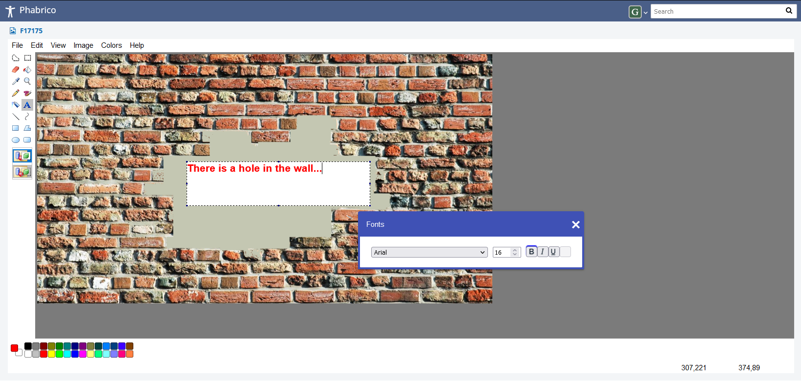

# JSPaint image editor

JSPaint image editor is an embedded integration of a stripped down JSPaint and allows you to modify existing images of all kind.
JSPaint itself is a web-based MSPaint remake.
Speech recognition and eye gaze mode are not integrated in this plugin.

  

More information about JSPaint itself can be found at <https://github.com/1j01/jspaint>

[Index](../README.md) | [Previous Page](../11-Gitanos/README.md) |  [Next page](../13-Customization/README.md)