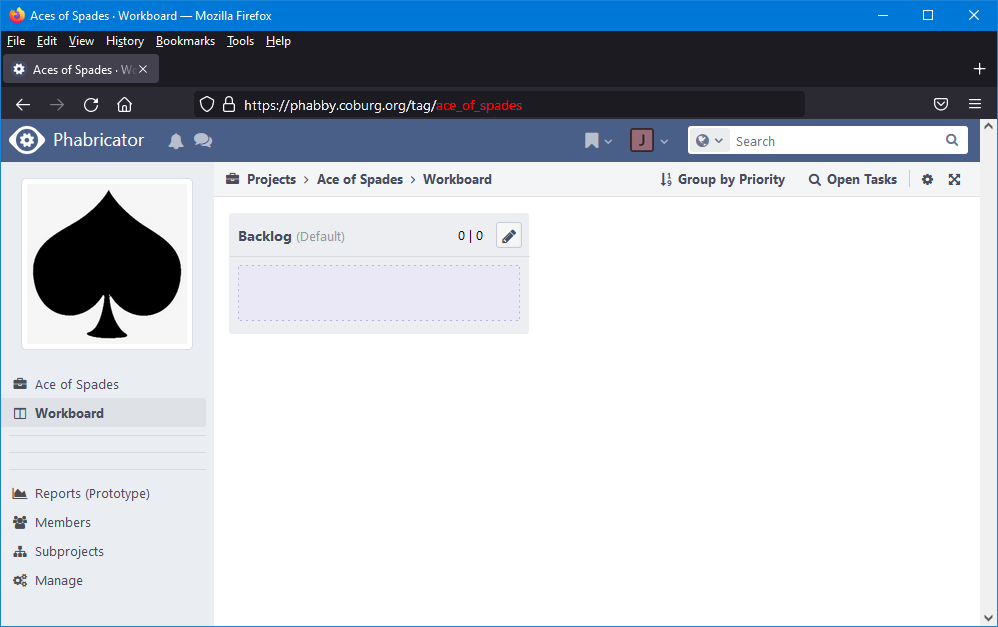

# Command Line Interfacing

Phabrico can be started from the command prompt with or without arguments.
If it's started without any parameter, Phabrico wil just run as a process and act as it would have been started as a service.
However, you might need to start it in a elevated command prompt as it tries to create a HTTP listener (for which administrative rights are needed).

## /download
Usage:
```
Phabrico /download  [json-config-file]  /token:[phabricator-conduit-token]

Phabrico /strip  [json-config-file]
```

With `/download` you can download some Phriction documents and/or Maniphest tasks from Phabricator.

With `/strip` you can copy some Phriction documents and/or Maniphest tasks from a Phabrico file. You will be asked for the location of this database file when executing the command.

The specification of these Phriction documents and Maniphest tasks is done by means of a JSON configuration file.

An example of such JSON config file:
``` json
{
    "source": "http://phabby.coburg.org",
    "destination": "c:/temp/custom-phabrico.data",
    "username": "lemmy",
    "password": "K1lm1ster!!!",

    "maniphest": {
        "projectTags": [
            "lyrics",
            "instrumental"
        ],

        "userTags": null,
    },

    "phriction": {
        "projectTags": [
            "lyrics",
            "instrumental"
        ],

        "userTags": null,

        "combined": false,
        "tree": true
    },

    "users" : [
        {
            "name": "phil",
            "password": "seymour",
            "tags": [
                "ace_of_spades"
            ]
        },
        {
            "name": "mikkey",
            "password": "sonor",
            "tags": [
                "bomber"
            ]
        }
    ]
}
```

| Parameter                  | Value                                                                                                                                                    |
|----------------------------|----------------------------------------------------------------------------------------------------------------------------------------------------------|
| `source`                   | address of Phabricator server                                                                                                                            |
| `destination`              | file which will contain the Phabrico database. You need to use regular slashes instead of backslashes (!)                                                |
| `username`                 | username to be used in Phabrico                                                                                                                          |
| `password`                 | password to be used in Phabrico                                                                                                                          |
| `maniphest/projectTags`    | array of project tags to which the maniphest tasks to be downloaded have to belong to (can be null)<br />Where to find these tags, see further below     |
| `maniphest/userTags`       | array of users which are subscribed to the maniphest tasks to be downloaded (can be null)                                                                |
| `phriction/projectTags`    | array of project tags to which the phriction documents to be downloaded have to belong to (can be null)<br />Where to find these tags, see further below |
| `phriction/userTags`       | array of users which are subscribed to the phriction documents to be downloaded (can be null)                                                            |
| `phriction/combined`       | if true, only phriction documents will be downloaded where ALL given projects/users are subscribed to                                                    |
| `phriction/tree`           | if true, underlying phriction documents will also be downloaded                                                                                          |
| `users/name`               | name of secondary user                                                                                                                                   |
| `users/password`           | password of secondary user. The minimum password requirements are not validated here, but this will happen when you change the password in Phabrico.     |
| `users/tags`               | array of user role tags. Currently, only 1 user role tag per user is supported.<br />Where to find these user role tags, see further below               |


If the JSON data above is stored in a file `c:\temp\phabrico.json` and the command below is executed:
```
Phabrico /download  c:\temp\phabrico.json  /token:api-abc4a4opqxyzijka3q2azo8apaos
```

Phabrico will connect to Phabricator at http://phabby.coburg.org using the `api-abc4a4opqxyzijka3q2azo8apaos` Conduit API token.
It will create a Phabrico database file `c:\temp\custom-phabrico.data` which can be accessed by means of user `lemmy` and password `K1lm1ster!!!`.
All Phriction documents and Maniphest tasks will be downloaded where `instrumental` or `lyrics` is tagged in.
For Phriction, all underlying documents are also downloaded.

The newly created Phabrico database file can be configured in the `Phabrico.exe.config` file (`DatabaseDirectory`)
``` xml
<?xml version="1.0" encoding="utf-8"?>
<configuration>
    <appSettings>
        <add key="RemoteAccess" value="No"/>
        <add key="TcpListenPort" value="13467"/>
        <add key="DatabaseDirectory" value="C:\temp\custom-phabrico.data"/>
    </appSettings>
    <startup>
        <supportedRuntime version="v4.0" sku=".NETFramework,Version=v4.6.1"/>
    </startup>
    <runtime>
        <assemblyBinding xmlns="urn:schemas-microsoft-com:asm.v1">
            <dependentAssembly>
                <assemblyIdentity name="System.Runtime.InteropServices.RuntimeInformation" publicKeyToken="b03f5f7f11d50a3a" culture="neutral"/>
                <bindingRedirect oldVersion="0.0.0.0-4.0.1.0" newVersion="4.0.1.0"/>
            </dependentAssembly>
        </assemblyBinding>
    </runtime>
</configuration>
```

After restarting Phabrico, the new database will be used.


The project tags can be retrieved from the URL from the project page in Phabricator itself:

 <br />

