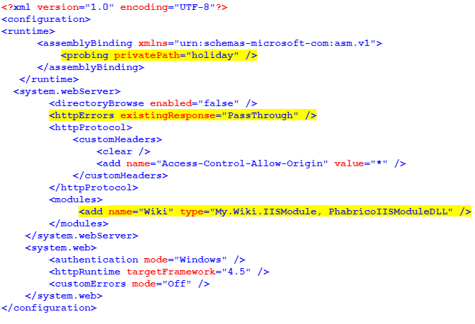

# Customization

Phabrico can be installed as a customizable HTTP module in IIS by means of Nuget packages.

## Quick guide
Basically you need to implement the following things:
- a NuGet reference to the Phabrico package (and Phabrico plugin packages if needed)
- a class that inherits from `IHttpModule`
- a static reference to `Phabrico.Http.Server`
- a static constructor in which you initialize and customize Phabrico by means of the `Customization` object
- an `Init` and `Dispose` method (inheriting from `IHttpModule`)
  - the `Init` class method should execute the `Init` method from the `Phabrico.Http.Server`
  
The parameters for the `Phabrico.Http.Server` constuctor should be:

| #  | Parameter                  | Value                                       |
|----|----------------------------|---------------------------------------------|
| 1  | `bool remoteAccessEnabled` | true                                        |
| 2  | `int listenTcpPortNr`      | -1                                          |
| 3  | `string rootPath`          | (the baseURI you want to use in your URL)   |
| 4  | `bool isHttpModule`        | true                                        |

An exampe in C#:

``` cs
using Phabrico;
using System.Drawing;
using System.Web;

namespace My.Wiki
{
    public class IISModule : IHttpModule
    {
        static Phabrico.Http.Server httpServer;

        static IISModule()
        {
            httpServer = new Phabrico.Http.Server(true, -1, "holiday", true);

            httpServer.Customization.ApplicationName = "The Holiday Company";
            httpServer.Customization.ApplicationNameStyle["color"] = "white";
            httpServer.Customization.ApplicationNameStyle["font-weight"] = "bold";
            httpServer.Customization.ApplicationNameStyle["font-size"] = "17px";
            httpServer.Customization.ApplicationNameStyle["font-family"] = "lato,sans-serif";

            httpServer.Customization.ApplicationLogo = new Bitmap(typeof(IISModule).Assembly.GetManifestResourceStream("Phabrico.Images.logo.png"));

            httpServer.Customization.Theme = ApplicationCustomization.ApplicationTheme.Dark;
            httpServer.Customization.AvailableLanguages = new Phabrico.Miscellaneous.Language[] { "en", "de"};

            httpServer.Customization.HideConfig = true;
            httpServer.Customization.HideFiles = true;
            httpServer.Customization.HideManiphest = true;
            httpServer.Customization.HideNavigatorTooltips = false;
            httpServer.Customization.HideOfflineChanges = true;
            httpServer.Customization.HidePhriction = false;
            httpServer.Customization.HidePhrictionActionMenu = true;
            httpServer.Customization.HidePhrictionFavorites = true;
            httpServer.Customization.HideProjects = true;
            httpServer.Customization.HideSearch = false;
            httpServer.Customization.HideUsers = true;
            httpServer.Customization.IsReadonly = true;
        }

        public void Init(HttpApplication application)
        {
            httpServer.Init(application);
        }

        public void Dispose()
        {
        }
    }
}
```

 <br />


## Customization parameters

| Parameter                                   | Description                                                                                                                                                             | Default
| ------------------------------------------- | ----------------------------------------------------------------------------------------------------------------------------------------------------------------------- | -------
| ApplicationCSS                              | Global cascading style sheets which are injected in each page                                                                                                           | 
| ApplicationHeaderStyle                      | CSS styles for formatting the header on top (e.g. the background color of the header)                                                                                   |
| ApplicationLogo                             | The logo that should be shown in the top left corner                                                                                                                    | Phabrico logo
| ApplicationLogoStyle                        | CSS styles for formatting the ApplicationLogo                                                                                                                           | 
| ApplicationName                             | The name of the application that should be shown in the top left corner                                                                                                 | Phabrico
| ApplicationNameStyle                        | CSS styles for formatting the ApplicationName                                                                                                                           | 
| AuthenticationFactor                        | If Knowledge, one should authenticate with username and password to access Phabrico; If Public, no authentication is needed                                             | Knowledge
| CustomRemarkupRules                         | Dictionary of regexes for executing custom parser rules (**)                                                                                                            | 
| FavIcon                                     | If set to a PNG image, the PNG image will be used as icon in the browser tab; if not set, the default Phabrico icon will be used                                        | Phabrico icon
| HideConfig                                  | If true (*), Config screen will not be accessible                                                                                                                       | false
| HideFiles                                   | If true (*), Files screen will not be accessible                                                                                                                        | false
| HideManiphest                               | If true (*), Maniphest tasks will not be accessible                                                                                                                     | false
| HideNavigatorTooltips                       | If true (*), the tooltips for the menu items in the homepage will not be shown                                                                                          | false
| HideOfflineChanges                          | If true (*), Offline Changes screen will not be accessible                                                                                                              | false
| HidePhame                                   | If true (*), Phame blogs will not be accessible                                                                                                                         | false
| HidePhriction                               | If true (*), Phriction/wiki documents will not be accessible                                                                                                            | false
| HidePhrictionActionMenu                     | If true (*), the menu on the right side of the Phriction documents is no longer visible                                                                                 | false
| HidePhrictionChanges                        | If true (*), the changes made in Phriction/wiki documents can not be seen or undone                                                                                     | false
| HidePhrictionFavorites                      | If true (*), Phriction/wiki documents can not be marked as favorite                                                                                                     | false
| HidePlugins                                 | If true (*) for a specific plugin, the plugin will not be accessible. See further below for more information.                                                           | false
| HideProjects                                | If true (*), Phabricator projects will not be accessible                                                                                                                | false
| HideSearch                                  | If true (*), Search field will not be accessible                                                                                                                        | false
| HideUsers                                   | If true, Phabricator users will not be accessible                                                                                                                       | false
| IsReadonly                                  | If true (*), no Phriction document or Maniphest task can be edited                                                                                                      | false
| AvailableLanguages                          | Array of language codes for Phabrico application.  (Content of Phriction documents might be translated if translation exists). If not set, all languages are available  | Language of browser or English
| MasterDataIsAccessible                      | If false, the master data on Phabricator is not accessible via Phabrico. If IsReadonly is true, MasterDataIsAccessible wil be false                                     | true
| Theme                                       | Auto, Light or Dark; If Auto, the user can change the theme in the Config screen (if accessible)                                                                        | Auto

(*) Some of the Customization parameters are boolean vectors. These can be set as a normal boolean value (true or false), but can also be set to a LINQ method with some browser specifics parameter.
The example below will hide the Action menu in Phriction in case you're using Firefox but not if you are using Edge:
```
httpServer.Customization.HidePhrictionActionMenu = new Phabrico.Miscellaneous.BooleanVector<Phabrico.Http.Browser>(browser => browser.UserAgent.ToLower().Contains("firefox") == false);
```
The following browser specifics are avaiable: IPAddress, (Phabrico) Language, URL and UserAgent

(**) CustomRemarkupRules is a `Dictionary<string,string>` from which the key represents a regex to match a token, the value is the replacement. You can also use backreferences in the replacement string.
The example below will change the colors of highlighted texts in to black/yellow:
```
httpServer.Customization.CustomRemarkupRules[@"^!!([^\n]*?!*)!!"] = "<span style='background:black; color:yellow;'>$1</span>";
```

### HidePlugins
Some Phabrico plugins can be specifically hidden by means of the HidePlugins parameter.
This is a dictionary of BooleanVectors per plugin name.
The following plugin names are available:
* DiagramsNet
* Gitanos
* JSPaintImageEditor
* PhrictionSearch
* PhrictionToPDF
* PhrictionTranslator
* PhrictionValidator

For example:
```
httpServer.Customization.HidePlugins["DiagramsNet"] = new Phabrico.Miscellaneous.BooleanVector<Phabrico.Http.Browser>(browser => browser.IPAddress.Equals("127.0.0.1") == false);
```


## IIS Configuration
* WebSocket protocol should be installed in IIS:

 <br />

* 2 extra lines should be added to the C:\inetpub\wwwroot\web.config:
  * `probing/privatePath` points to the subdirectory in the C:\inetpub\wwwroot directory where the Phabrico IIS module is installed.
  * `modules/add` should contain a reference to your Phabrico IIS module
     * The `name` is custom and has no special meaning
     * The first part of the `type` (My.Wiki.IISModule) points to the full class name (i.e. Namespace + class name) of the IIS Http Module
     * Th last part of the `type` (PhabricoIISModuleDLL) points to the DLL containing the IIS Http Module. In this example this would be PhabricoIISModuleDLL.dll.
* a 3rd line is optional:
  * if `httpErrors/existingResponse` is set to `PassThrough`, you will see Phabrico-styled error pages instead of the IIS ones

 <br />

You can make use of a symbolic link in case you want your Phabrico IIS module not installed in the C:\inetpub\wwwroot directory.
If you execute the following statements in a command prompt window, you can keep your Phabrico IIS module in `C:\Program Files\PhabricoIIS`.
For IIS they are accessible via `MyPhabrico`

```
c:
cd c:\inetpub\wwwroot
mklink /D MyPhabrico "C:\Program Files\PhabricoIIS"
```

You can also install your Phabrico IIS module in a subdirectory in c:\inetpub\wwwroot directory, for example c:\inetpub\wwwroot\holiday.
Important in this case is that the name of the subdirectory must be the same as the 3rd parameter in your constructor:
```
httpServer = new Phabrico.Http.Server(true, -1, "holiday", true);
```

## app.config
You can set the following configuration parameters in the app.config file of the custom IIS HTTP module:

| Parameter                                   | Description                                 | Default
| ------------------------------------------- | ------------------------------------------- | -------------------------------------------------
| configuration/appSettings/DatabaseDirectory | Location of the Phabrico database file      | Directory where IIS HTTP module is installed in

[Index](../README.md) | [Previous Page](../12-JSPaint/README.md) |  [Next page](../14-CommandLineInterfacing/README.md)