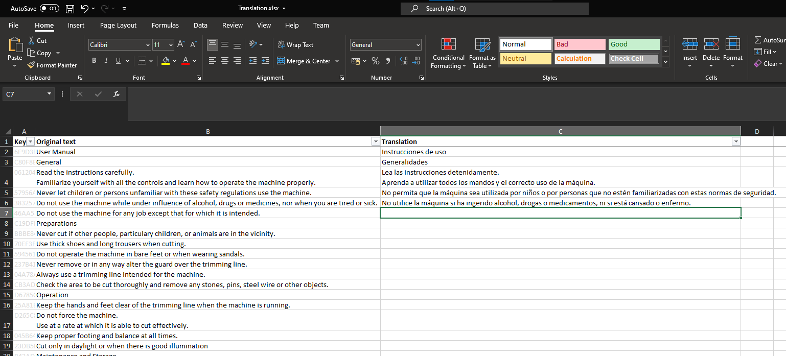

# Content translation

By default, Phabrico contains some basic multilingual functionality.
By installing the PhrictionTranslator plugin, you can also have translated copies of your Phriction documents.
These translated copies are local copies and will not be uploaded to Phabricator.

The translations themselves are performed by an translation engine and are stored in a separate database file (i.e. phabico.translation).
The translations can still be manually edited afterwards.

There are 2 translation engines:
- [DeepL](https://www.deepl.com)
- MS Excel Importer/Exporter

## Quick guide
Select the document you want to translate and click on *Translate* in the Actions menu:

  

A dialog will popup in which you enter the translation parameters:

  

| Parameter | Description
| --- | ---
| Translation engine | The name of the translation engine
| API Key            | Only for DeepL translation engine. The API key for authenticating to the translation engine
| Source language    | The language in which the document is currently written (and how it appears in Phabricator)
| Target language    | The language in which the document should be translated to

After you click *OK*, you might be asked if you also want to translate the underlying documents:

  

Just before the translation starts, a warning is shown that you should not send sensitive information over the internet:

  

When everything is translated, a message is shown:

  

If you change the language to the one you have just translated into, you will see the translated content:

  

  

## Manual editing
Since the translation was performed by machine, some texts may have been translated incorrectly.
You can correct the translation yourself via *Edit translation*

  

The editor is similar as the original Phriction editor:

  

| Button | Description
| --- | ---
| Save Changes                   | Your modifications will be stored in the database
| Cancel                         | Your modifications will be not be stored in the database
| Revert to original translation | All your translation modifications on this document will be discarded

## Proofreading
You can also read both the master document and the translation document next to each other via *Proofreading* (or *Vertaling reviseren* in Dutch):

  

On the left side, you will see the original document.
On the right side, you will the translation.

  

The slider in the middle can be moved to left or right, if needed.

On top of the screen, you have a toolbar with one button: 

  

If you click on this button, you will see the Remarkup content of both versions.
The translation can be modified.

  

## Approval of a translation
After a document is translated, the translation will be marked as 'unreviewed'.
This is visualized by means of a 'big blue world icon' in front of the document's title:

  

All unreviewed translation can be seen via *Unreviewed translations*:

  

  

If you click on a title, the unreviewed translation will be loaded.

If you want to remove a translation completely, you should click on the *Undo* button.

> ⚠️ The *Unreviewed translations* are only shown for the current language

To remove a translation from this *Unreviewed translations* list, you need to approve the translation:

  

The 'big blue world icon' will also disappear:

  

> ⚠️ Once you have approved a translation, you cannot undo it afterwards

## Excel Import/Export
When using the Excel translation engine, the content is translated in 2 steps.

  

First you export the document by clicking on the *Export File* button.
An Excel file will be generated, which contains 3 columns:

| Excel column name | Description
| --- | ---
| Key           | contains generated code to uniquely identify the text to be translated. The translator should not touch this data.
| Original text | contains all the texts to be translated in the original language.
| Translation   | should be filled in by the translator in the requested language.

  

When the translator has finished the translation, the Excel file can be imported again by clicking on the *Import File* button:
  

> ⚠️ The Excel translator has some known shortcomings 
> It uses for example some kind of a word-per-word translation in case the sentence contains special tags, like 
> for example hyperlinks. This might generate some confused translations 
> Suppose you have the following english text "More details can be found here" where "here" is a hyperlink to another document. 
> The Excel translator will generate 2 rows: "More details can be found" and "here". 
> If this text needs to be translated to Dutch, then the Excel translator will generate the following translation: 
> "Verdere details kunnen worden gevonden hier" which is incorrect, as the "here" word (hier) should placed somewhere in the middle of 
> the sentence: "Verdere details kunnen hier worden gevonden" 
> Textformatting like bold and italic do not have this issue, as the exported translations will contain the remarkup formatting 
> E.g. \*\*bold\*\*

## Some remarks
* Not all content is automatically translated. Codeblocks, usernames and project names, for example, will not be translated.
* The titles of Notification blocks are only translated if configured under *UI Controls*: 
   
* Diagrams are not automatically translated, but a copy is made for each of them so that you can translate them manually. These diagram copies are also marked as 'unreviewed' and can also be approved in the *Diagrams* screen by means of the green button:    
The copies of these translated diagrams can be undone via the *Offline Changes* screen.
If you *undo* a diagram, the translated document will link back to the original diagram.
This way you can create diagrams which are the same for all languages.

[Index](../README.md) | [Previous Page](../14-CommandLineInterfacing/README.) |  [Next page](../16-InaccessibleFiles/README.md)