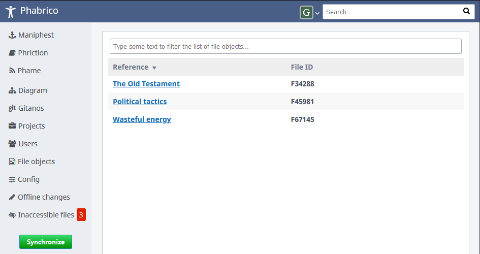

# Inaccessible Files

It can happen that someone creates a wiki page or a task on Phabricator which references a file (e.g. an image).
The wiki page or task itself is visible to everyone, but the referenced file is not.
It is then marked as 'Restricted File' on Phabricator.
The author has to unrestrict it to make it visible to everyone.

The Inaccessible Files screen lists these restricted files.
If there are restricted files found, the Inaccessible Files screen will appear at the bottom of the navigation
menu with a red notification how many restricted files were found

  

[Index](../README.md) | [Previous Page](../14-CommandLineInterfacing/README.md)